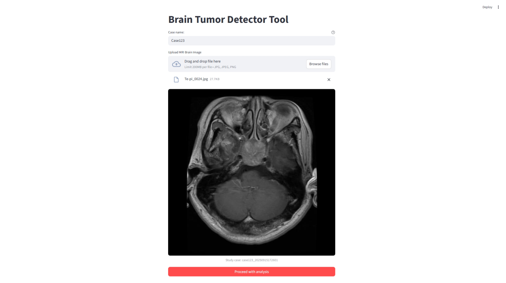
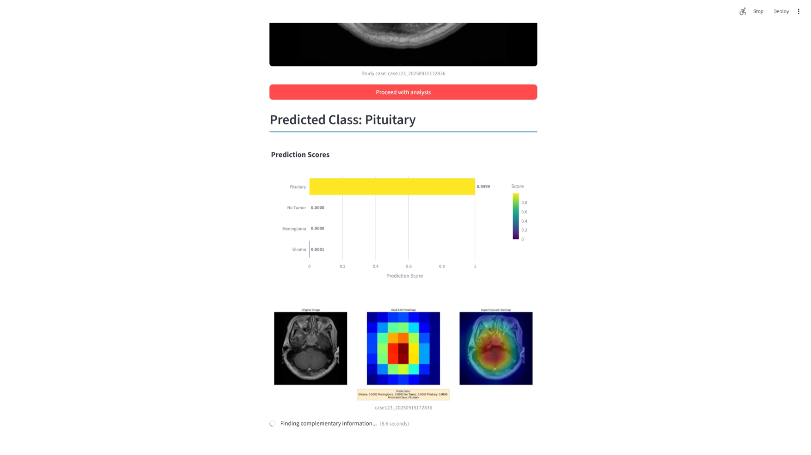
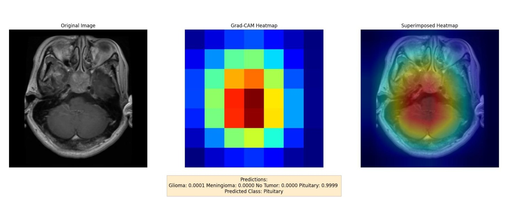
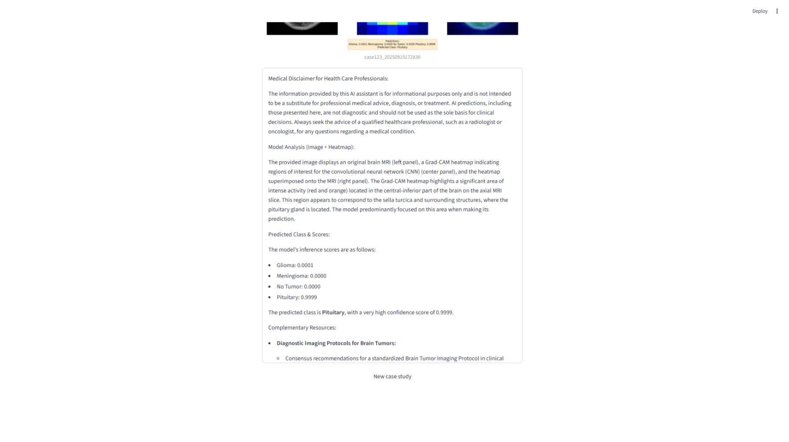

# Automatización de la clasificación de tumores cerebrales a partir de MRI.

Sistema basado en inteligencia artificial para la clasificación precisa y explicable de tumores cerebrales a partir de imágenes de resonancia magnética (MRI), que combine la clasificación de tumores cerebrales a través del uso de redes neuronales convolucionales (CNN), mecanismos de explicabilidad (Grad-CAM) y la generación de reportes en lenguaje natural mediante modelos de lenguaje de gran tamaño (LLMs).

## Configuración del entorno
* Creación de entorno virtual (Python 3.10 requerido)
```
python -m venv .venv

.\.venv\Scripts\activate.bat
```
* Instalación de librerias requeridas
```
pip install -r requirements.txt
```
## Variables de entorno
* Es necesario colocar las key para la utilización de la interaccion con el LLM (Gemini) coloca tu key en el archivo ```.env```. [Genera tu key aquí](https://ai.google.dev/gemini-api/docs/api-key?hl=es-419#set-api-env-var)

## Descarga el modelo
* Debido a los limites de tamaño de archivos en Github es necesario que descargues el modelo usando este [vinculo](https://drive.google.com/drive/folders/1n3kZHhpODQwFrGaLBMIN4WPn6bnMhScF?usp=sharing)
y lo coloques en el directorio ```models/```.

## Ejecuta la herramienta
```
python -m streamlit run app.py
```
Se abrirá tu navegador de forma predeterminada con la herramienta lista para tu investigación.

## Interfaz Grafica
* Carga de MRI


* Inferencia (CNN)



* Analisis de inferencia (LLM)
